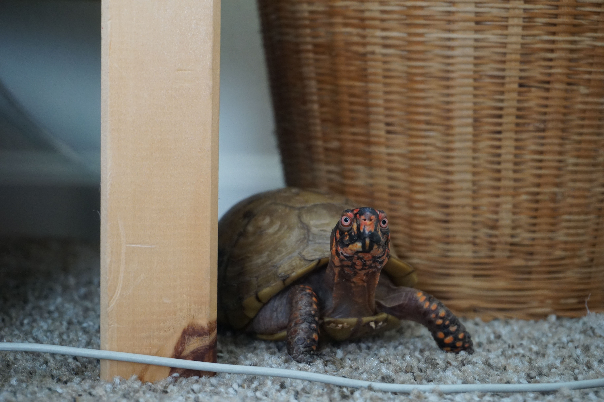
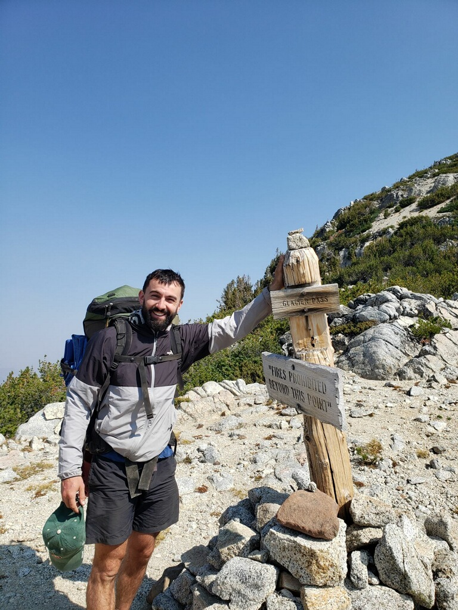

 

 

I am an Oregon native and grew up in Portland. I received my undergraduate degree from the [University of Puget Sound](https://www.pugetsound.edu/) in Tacoma, WA. At Puget Sound, I was halfway through a degree in English before making a *hard* pivot and getting degrees in economics and Japanese. 

 

After graduating from the University of Puget Sound, I moved to [湯前町 (Yunomae), Japan](https://earth.google.com/web/data=MkEKPwo9CiExVEc3VDhRYzFOdnBzamdXQXJ2a0s2eFRGWTFkNm1JWlgSFgoUMDBDOUJCMzk0NzI1MTNBRTQwNkEgAQ) for a couple years to teach English. In Japan, I spent my time studying the language, riding trains, and learning to cohabitate with the biggest spiders I have ever seen. 

 

I returned to Oregon in 2017 to start a Ph.D. in economics at the University of Oregon in Eugene. In Eugene, I live with my partner (not featured) and my turtle (featured). When I am not working on my degree, I am playing, discussing, or contemplating basketball. I also fancy myself an outdoor enthusiast, which is a big reason I keep ending up back in Oregon.
