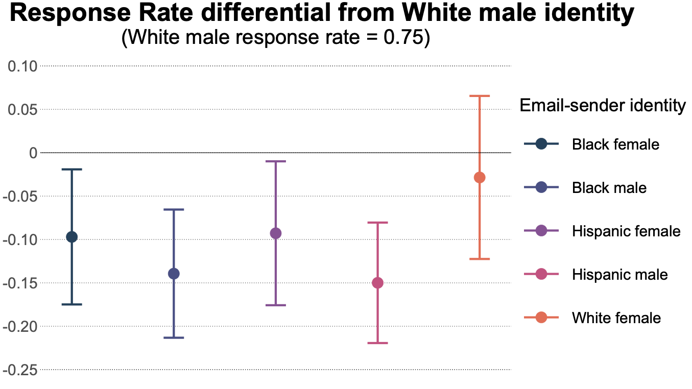

I use an equity and justice framework to explore issues concerning environmental, climate, and criminal justice. However, I am also interested in projects concerning houselessness, gun control, and the intersection of machine learning and racial equity. 
 
 

# Working Papers

 

 

[Police are less likely to respond to requests for help from minorities: Field experiment evidence of police discrimination based on citizen race, ethnicity, and gender](papers/Stanford_2022_JMP.pdf)
  *Garrett Stanford*
 

 

[Public preferences for a state-level carbon cap-and-trade program](papers/Stanford_Cameron_2022.pdf) 
  *Garrett Stanford and Trudy Ann Cameron*

 

# Research in Progress

**Asset Forfeitures and Traffic Fines: Substitutes or Complements?** 
  *Garrett Stanford*
 

Financial incentives can influence policing. Both through "taxation by citation" and through asset forfeiture, police departments generate revenue through policing practices. While both of these revenue sources are common in many police departments, little is known about how they affect policing behaviors---or how they interact. Using several rich datasets on policing and municipal budgets, I measure the elasticity of substitution between traffic citations and asset forfeiture at the department level. The findings have important implications for policy makers, social activists, and researchers.

  

**Distributional Effects of Gun Control Laws** 
  *Tami Ren and Garrett Stanford*
  

In November, Oregon narrowly passed a measure that restricts the possession of firearms, reflecting a national push for stricter gun control. The new law charges the Oregon State Police (OSP) with issuing permits to lawfully own a firearm, and allows the OSP discretion when deciding to issue a permit. While proponents of the law have lauded the discretionary power, opponents are concerned that designating an institution that potentially struggles with biased practices as an important gatekeeper could have unintended impacts. We use a field experiment to test for the presence of racial discrimination concerning firearm ownership. 

  

**Using Machine Learning to Explore Racist Stereotypes** 
  *Ed Rubin and Garrett Stanford* 
  

Recent advances in machine learning have created opportunities for new and compelling research. We use the AI programs GPT-3 and Dall_e to explore the prevalence of racial stereotypes in machine learning programs. We then explore the implications of these results for researchers and policymakers.  

